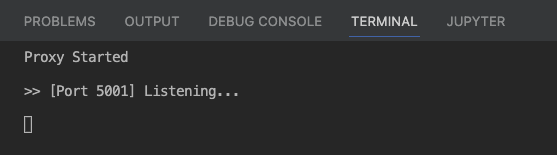
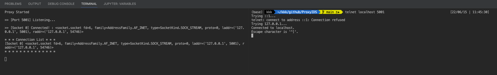
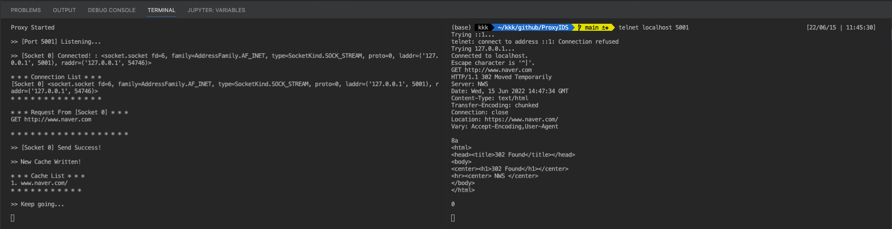

# ProxyIDS

# 0. 개요
- implementation IDS, using Python Socket Proxy Server
- 파이썬 소켓 통신을 활용한 간단한 IDS를 구현하였다.

# 1.0 주제 소개
## 1.1 프로젝트 주제 : Proxy IDS
- 이번 프로젝트에서는 Malware URL과 통신이 탐지되면 차단하는 기능을 가진 Web Proxy Server를 제작하고자 한다.
- 상기 Malware URL의 DataSet은 urlhaus라는 별도의 보안 커뮤니티를 활용하였다.

## 1.2 참고
> ### IDS
> - 침입 탐지 시스템. Intrusion Detection System.
> - 방화벽과 더불어 외부의 침입을 통제하는 보안 장비이다.
> - 네트워크 구성 중 in-line에 위치한 장비이며, IP-Port 기반으로 차단하는 방화벽과 달리 통신 내용까지 통제하는 더 높은 Layer에서 동작하는 보안 장비이다.
> - 인입된 통신의 Body까지 내부 Rule에 따라 검사하고 특정 문자열 또는 정규식과 같이 일부 일치하는 패턴이 존재하면 알림을 띄워주는 시스템이다.
> - 여기서 더 발전된 형태가 IPS(Intrusion Protection System.)이다.
> - IPS는 Rule에 따라 탐지만 할지, 차단까지 수행할지 설정할 수 있다.
> ### Proxy
> - 내부 네트워크 인프라 구축 시 내부의 자산을 감추어야 할 필요가 있을 때 Proxy 서버를 이용하면 직접 통신하는 것이 아니라 별도의 대리자를 통해 통신할 수 있다.
> - 은닉 기능 외에 Web Cache 기능을 구성하면 한 번 방문했던 페이지의 리소스를 미리 캐싱하여 프록시 서버를 통해 접속 시 보다 빠르게 접속 할 수 있는 기능 또한 존재한다.

## 1.3 Malware URL
- Malware URL은 바이러스, 악성코드라고도 불리는 Malware가 배포되었거나 그와 관련된 URL이다. 많은 Security Community에서는 다양한 보안 위협을 공유하고 제보한다. URL haus가 대표적이다. [Link](https://urlhaus.abuse.ch/)
- URL + haus(독일어: house)의 합성어로 2018년도 부터 운영되어 온 Security Community 중 하나이다. 이 커뮤니티에서는 Malware 배포와 관련된 URL Dataset이 존재하는데 2022.06.07 기준 약 1천만 건의 Data가 저장되어 있다.

# 2.0 기능 식별
본 프로젝트에서 구현할 주요 기능은 다음과 같다.
1. 소켓을 활용한 Proxy Server 구축.
2. 서비스가 안정적으로 동작하기 위한 Thread 구조.
3. URL 필터링

# 3.0 기능 구현

시간 상의 한계로 완벽하게 구현할 수는 없었지만 최대한 활용될 수 있도록 구현하였다.
`src/app.py` 단일 파일로 구성되었으며 실행 시 미리 지정된 socket port가 listening 상태에 들어간다.

여기서는 테스트를 위해 telnet으로 Proxy Server에 접속하였다.
다음은 접속된 화면이다.

다음으로 임의의 URL을 요청한다.
그 결과 http 헤더 및 결과값이 보이는 것을 확인할 수 있었다.

